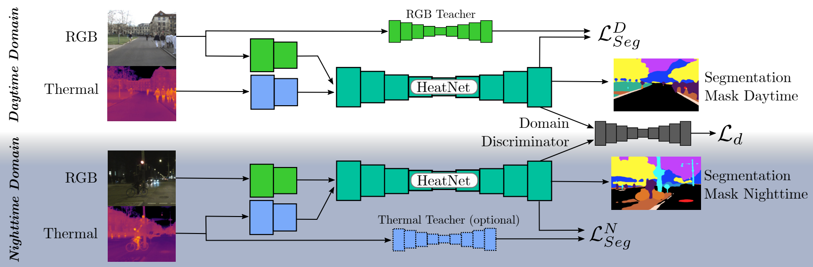

# Heatnet: Bridging the day-night domain gap in semantic segmentation with thermal images

Code for the IROS 2020 publication "Heatnet: Bridging the day-night domain gap in semantic segmentation with thermal images" by Johan Vertens, Jannik Zürn, and Wolfram Burgard




## Citation

If you use this code in your research, please cite our paper:

```
@inproceedings{vertens2020heatnet,
  title={Heatnet: Bridging the day-night domain gap in semantic segmentation with thermal images},
  author={Vertens, Johan and Z{\"u}rn, Jannik and Burgard, Wolfram},
  booktitle={2020 IEEE/RSJ International Conference on Intelligent Robots and Systems (IROS)},
  pages={8461--8468},
  year={2020},
  organization={IEEE}
}
```

## Installation


## Dataset Download

Please download our dataset from the [project website](http://thermal.cs.uni-freiburg.de/) and extract it somewhere on 
your hard drive. Please download the training and validation data and extract them into separate folders.

## Usage

In the following, we describe how to use the code for training and evaluating the Heatnet model.

### Model Training

To train the model, run the following command:

```bash
python scripts/main.py --data <path_to_training_data> --valdata <path_to_validation_data>
```


### Model Evaluation
 

```bash
python scripts/main.py --data <path_to_training_data> --valdata <path_to_validation_data> --resume <path_to_model> --evaluate
```


### Configuration

Model architecture definitions, training parameters, and other settings can be found in the `heatnet_conf.json` file.
